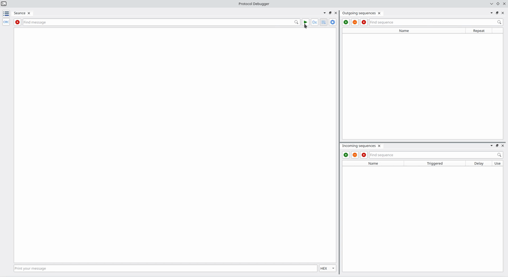

# Protocol Debugger

Функциональный терминал, предназначенный для отладки, интеграции и реверс-инжиниринга аппаратных и программных средств. Встроенная поддержка языка Lua предоставляет пользователям широкие возможности в обработке и визуализации данных.



## Зависимости
* **Qt5/Qt6**;
* **Lua5 (5.4)** - реалиация стека Lua;
* **libzip** - архивы используются в механизме сессий;
* **nlohmann json** - современная библиотека для работы с json;

## Другие используемые библиотеки
* **Qt-Ads** - docking-система, на базе которой построен интерфейс программы. Будет загружена и собрана автоматически при сборке protodb;
* **Sol3 (sol2 v3.0)** - С++ header-only обёртка над Lua, предоставляющая пользователю широчайшие возможности по работе со стеком языка. Включена в проект;

## Процесс сборки (Linux)
Начиная с версии 1.0.2 процесс сборки был значительно упрощён. Теперь достаточно следующей последовательности команд:
```sh
$ cmake ./ -B ./build -DQT_BUILD_VERSION:STRING=6 -DCMAKE_BUILD_TYPE=Release
$ cmake --build ./build --target all -- -j8
```

Где: 
_-DQT_BUILD_VERSION:STRING=6_ - сборка программы с Qt6.
_-DQT_BUILD_VERSION:STRING=5_ - сборка программы с Qt5.

Далее производим установку стандартными средствами cmake:
```sh
# cmake --install ./build --prefix "/usr/"
```
Внимание! Рекомендуется использовать готовые пакеты для пакетных менеджеров ваших дистрибутивов.

Следующие команды завершают процесс установки. Данные команды позволяют указать путь до библиотек protodb-base, protodb-gui и protodb-dev, которые необходимы для запуска и разработки плагинов для программы. Команды подразумевают, что библиотеки уже находятся в каталоге /usr/lib/protodb
```sh
$ mkdir -p /etc/ld.so.conf.d/
$ cd /etc/ld.so.conf.d/

$echo "/usr/lib/protodb" > ./protodb.conf
```

## Создание пакета (Archlinux)
Для пользователей Archlinux подготовлены PKGBUILD для пакетов protodb-qt5 и protodb-qt6. PKGBUILD производит автоматическую сборку и подготавливает пакет для пакетного менеджера дистрибутива. 

Сборка пакета:
```sh
$ makepkg -p pkgbuild-protodb-qt6
```
Результатом выполнения команды станет сжатый файл pkg, который необходимо установить в систему:
```sh
$ pacman -U protodb-qt6-1.0.2-1-x86_64.pkg.tar.zst
```

## Процесс сборки (Windows)
Процесс сборки для ОС Windows аналогичен, отличается только необходимостью предварительного создания сборочного окружения.