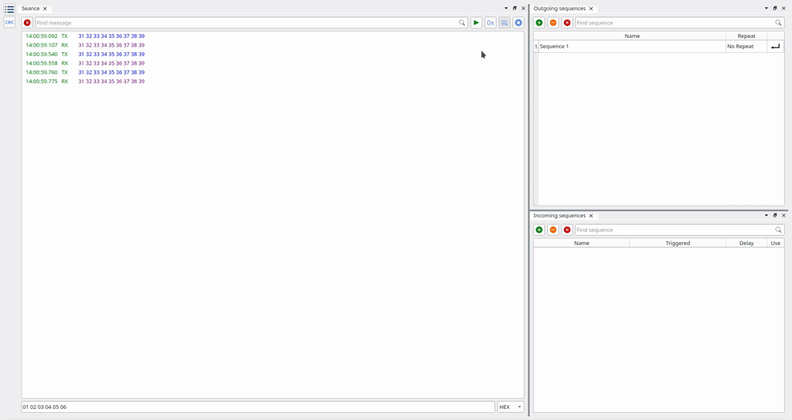
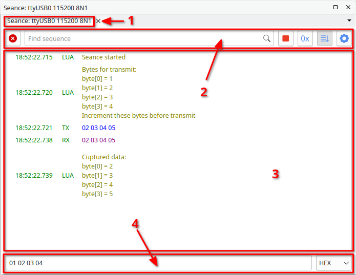
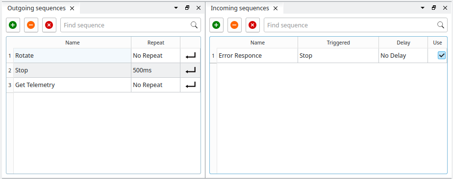
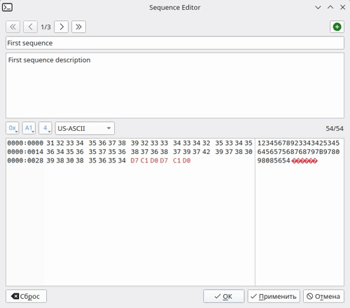
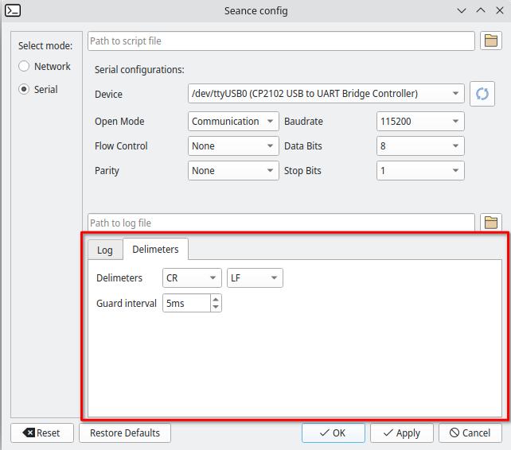
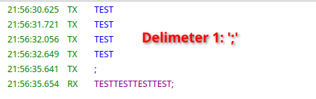
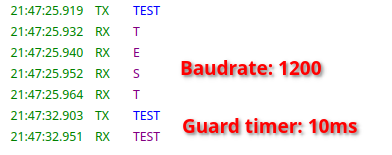

# Protocol Debugger

Кроссплатформенное программное обеспечение, предназначенное в первую очередь для реверс-инжениринга протоколов проприетарных устройств. Protodb является свободным аналогом DockLight обладая более широким функционалом, в том числе поддержкой скриптов на LUA.


## Зависимости
* **Qt5/Qt6**;
* **Lua5 (5.4)** - реалиация стека Lua;
* **libzip** - архивы используются в механизме сессий;
* **nlohmann json** - современная библиотека для работы с json;

## Другие используемые библиотеки
* **Qt-Ads** - docking-система, на базе которой построен интерфейс программы. Будет загружена и собрана автоматически при сборке protodb;
* **Sol3 (sol2 v3.0)** - С++ header-only обёртка над Lua, предоставляющая пользователю широчайшие возможности по работе со стеком языка. Включена в проект;

## Знакомство с интерфейсом
Окно программы можно условно поделить на три части: боковая панель с гамбургер-меню(1), лог сеанса (2) и таблицы последовательностей(3).

<p align="center">
    
</p>

Приложение построено с использованием библиотеки Qt ADS, что позволяет пересобирать раскладку окна индивидуально под пользователя, а механизм сессий позволяет программе её запомнить. При необходимости, окно сессии или любую из таблиц можно закрыть, восстановить закрытые окна можно через гамбургер-меню , раздел widgets.



### Сеанс
Вкладка содержит следующие элементы: заголовок с информацией о подключении (1), панель управления (2), лог(3) и строку быстрой отправки(4).
Панель управления содержит следующие элементы (слева-направо): кнопку "Очистить лог" , поле "Фильтр", кнопку "Старт/Стоп"  , кнопку "Формат" (HEX/ASCII) , кнопку "Автоматическая прокрутка"  и кнопку "Параметры сеанса" .

<p align="center">
    
</p>

Строка быстрой отправки предназначена для отправки данных без создания последовательностей. Функционал в данном случаю сокращен и позволяет только определять формат посылки между HEX и различными вариантами ASCII. Если сеанс не запущен, то при попытке отправки данных он будет запущен автоматически.

### Таблицы последовательностей
<p align="center">
    
</p>

Таблицы хранят именованное описание последовательностей байт. Всего таблиц две: incoming (входящие) и outgoing (исходящие).

Таблица исходящих состоит из трёх столбцов: имя последовательности, интервал повтора и кнопка "Отправить/Прекратить отправку"  . Эти последовательности можно отправить нажатием на соответствующую кнопку. Если значение интервала повтора равно нолю (no repeat), отправка будет однократной. В противном случае, повторные отправки будут происходить через заданный интервал.

Таблица входящих содержит список последовательностей, при приёме которых логика может отправить что-то в ответ. Таблица состоит из четырёх столбцов: имя последовательности, имя ответной последовательности(triggered), интервал задержки ответа и флаг "Использовать". Имя ответной последовательности должно соответствовать одной из последовательностей в таблице исходящих. Флаг "Использовать" позволяет включать/отключать реакцию на последовательности из таблицы.

Положение элементов таблицы можно сменить с помощью перетаскивания на нужную позицию.

Перед началом работы, последовательность необходимо создать. Для этого необходимо нажать на кнопкe , что создаст последовательность. Двойной клик по последовательности откроет диалог редактирования, удалить последовательность можно кнопкой с пиктограммой , а кнопка  очистит таблицу.

<p align="center">
    
</p>
В диалоге возможно переключаться между редактируемыми последовательностями, создать ещё одну последовательность, задать имя последовательности, а также написать для себя заметку об этой последовательности. Внимание! Некоторые настройки будут применены только после старта нового сеанса!

### Настройка сеанса
Сеанс имеет множество настроек, доступ к которым можно получить через кнопку "Параметры сеанса" . При нажатии на кнопку вам будет показан соответствующий диалог, в котором вы должны будете указать: тип устройства(1), путь до файла-скрипта(2) (опционально), настроить выбранное устойство(3), указать путь до текстового лога(4) (опционально) и, наконец, настроить сам механизм логгирования(5).

<p align="center">
    
</p>

Настройки лога влияют не только на текстовый лог, но и на его отображение на вкладке "Сеанс". Ниже подробное доступных описание настроек: 

**Append file** - если включено, дописывать лог в конец файла, предварительно иначе затереть старые данные.

**Timestamp** - опция включает или выключает отображение метки времени в логе. Также возможно задать формат данной метки.

**Channel names** - опция включает или выключает текстовое отображение имени канала в логе.

**Channel 1, Channel 1, Comments** - всего существует четыре канала лога: first (RX), second (TX), user и error. Названия каналов RX, TX и USR можно менять для повышения читаемости, также можно отключить логгирование этих каналов.

На случай, если вы забыли указать путь до файла лога, его можно экспортировать или импортировать на вкладке "Сеанс" через гамбургер-меню .

Если вы не обнаружили необходимый тип устройства, проверьте, загружен ли соответствующий плагин.

### Делиметры
Делиметры предназначены для разделения пакетов данных между собой. На данный момент пользователю доступны два типа делиметров: по символу-разделителю и по времени.

<p align="center">
    
</p>

Каждый раз, встречая разделитель, логика прогаммы будет формировать новое событие, которое будет зафиксировано в логе программы. Следовательно, данный символ можно использовать как для разделения идущих друг за другом пакетов данных, так и наоборот, для накопления данных - новое событие не будет зафиксировано, пока не будет получен разделитель. Последнее полезно при работе с низкоскоростными интерфейсами. Разделители могут иметь произвольные значения. Возможно указать два символа разделителя, например '\n\r' (CR LF), в этом случае новое событие будет сформировано по получении обоих символов подряд.

<p align="center">
    
</p>

Бесконечное ожидание разделителя не всегда является хорошей идеей. Пользователю доступна возможность указать защитный интервал, по истечению которого будет сформировано событие, содержащее всё содержимое буфера. Таймер сбрасывается при получении каждого нового символа.

<p align="center">
    
</p>

### Калькулятор CRC
В программу встроен универсальный калькулятор контрольных сумм, использование которого возможно как из скриптов, так и через графический интерфейс, позволяющий выбрать готовую модель CRC для расчёта или задать свою.

<p align="center">
    
</p>

**Width** - cтепень порождающего контрольную сумму многочлена. Допустимые значения от 3 до 64.

**Poly** - cам пораждающий полином.

**Seed** - значение на момент начала вычислений.

**XOR** - число, с которым складывается по модулю 2 полученный результат.

**Reflect In** - флаг, указывающий на начало и направление вычислений, для обнаружения пакетов ошибок должно соответствовать порядку передачи в канале. Существует два варианта: False — начиная со старшего значащего бита (MSB-first) или True — с младшего (LSB-first);

**Reflect Out** - флаг, определяющий, инвертируется ли порядок битов регистра при входе на элемент XOR.

## Механизм скриптов
Нередко для эффективного разбора протокола или отладки устройства необходимы методы обработки, характерные для конкретного случая. Для реализации этих методов пользователю предоставлен механизм скриптов. Перед запуском сессии необходимо указать путь к скрипту через диалог "Параметры сессии".

Механизм предоставляет пользователю возможность задать собственные обработчики на следующие события: старт сессии, отправка данных, приём данных, завершение сессии.

Обработчик события "отправка данных" вызывается ДО фактической отправки данных. В этот обработчик передаётся массив байт, содержимое которого перед отправкой можно произвольно изменять.

В обработчик события "приём данных" данные попадают сразу после приёма и регистрации в логе. В обработчик передаётся копия данных, изменять их бессмысленно, однако для разбора пакета этого достаточно.

Весь остальной функционал зависит от возможностей конкретного языка. Protodb из коробки поддерживает скрипты на Lua, а в репозитории есть соответствующие примеры.

### LUA

LUA - это скриптовый язык программирования, особенностью является реализация большого числа программных сущностей минимумом синтаксических средств, а также простая интеграция в программное обеспечение, написанное на языке С/С++. Язык предназначен для пользователей, не являющихся профессиональными программистами, вследствие чего большое внимание уделено простоте дизайна и лёгкости обучения.
        
На начальных этапах разработки protodb было решено не идти путём Docklight в виде разработки собственного DSL, а воспользоваться уже существующим скриптовым языком. LUA для этих целей подходил лучше всего.

Логика программы в качестве реакции на события, а именно старт сессии, отправка данных, приём данных и завершение сессии, будет вызывать через стек LUA строго определенные функции. Ниже представлен базовый шаблон скрипта:

```lua
function start()
    log:print("Seance started")
end

function stop()
    log:print("Seance stoped")
end

function beforeTransmit(msg)
    -- В обработчике beforeTransmit можно поработать с данными до их отправки.
    -- Например, добавить к посылке контрольные суммы.
    -- Помните, начальный индекс в массиве LUA - 1, а не 0.
end

function afterReceive(msg)
    -- Обработчик afterReceive служит для обработки принятых данных.
end
```

Также пользователю доступны некоторые стандартные библиотеки LUA, а именно base, bit32, math и string. Технически, добавление других библиотек не составляет труда, а текущий список ограничен по соображениям безопасности.

#### Служебные функции
```lua
-- вывод текста в лог программы.
log:print(text)

-- очистка лога сессии. Не влияет на файловый лог.
log:clear()

-- остановка сеанса.
seance:stop()

-- запись данных в порт. Процедура отправки аналогична другим, будет вызван обработчик beforeTransmit.
seance:send(bytes) 
```

#### Вспомогательные функции
```lua
-- возвращает float, собранный из массива длиной более 4-х байт (LE).
utils:tableToFloat(bytes) 

-- возвращает double, собранный из массива длиной более 8-ми байт (LE).
utils:tableToDouble(bytes) 

-- возвращает uint16_t, собранный из массива длиной более 2-х байт (LE).
utils:tableToShort(bytes) 

-- возвращает uint32_t, собранный из массива длиной более 4-х байт (LE).
utils:tableToWord(bytes) 

-- возвращает uint64_t, собранный из массива длиной более 8-х байт (LE).
utils:tableToDword(bytes) 

-- превращает float в массив из 4-х байт (LE).
utils:floatToBytes(value) 

-- превращает double в массив из 8-ми байт (LE).
utils:doubleToBytes(value) 

-- превращает uint16_t в массив из 2-х байт (LE).
utils:shortToBytes(value)</b> 

-- превращает uint32_t в массив из 4-х байт (LE).
utils:wordToBytes(value) 

-- превращает uint64_t в массив из 8-х байт (LE).
utils:dwordToBytes(value)
```
#### Расчет контрольных сумм

Класс CrcLogic содержит в себе реализацию логики расчета контрольных сумм. Реализация класса универсальна и позволяет задавать любые параметры модели CRC. Пример расчета контрольных сумм:

```lua
local bt = { 0x31, 0x32, 0x33, 0x34, 0x35, 0x36, 0x37, 0x38, 0x39 }
crc = Checksum()
    crc:setWidth(16)        -- Установка длина полинома в битах (от 3-х до 64-х).
    crc:setPoly(0x8005)     -- Значение полинома.
    crc:setSeed(0)          -- Начальное значение.
    crc:setReflectIn(true)  -- Начало и направление вычислений.
    crc:setReflectOut(true) -- Инверсия порядока битов регистра при входе на элемент XOR.
    crc:setXorOut(0)        -- Число, с которым складывается по модулю 2 полученный результат.
    crc:calculate(bt)       -- Расчет контрольных сумм. Может вызываться множество раз.

result = crc:finalize()     -- Получение результата(uint64_t) и сброс логики.
```

#### Таймеры
Пользователю доступен функционал таймеров, реализованный в виде биндинга QTimer в Lua, подробную информацию о котором можно посмотреть в справке на фреймворк Qt. Доступные функции:

```lua
-- возвращает true если таймер включен, иначе false.
timer:isActive() 

-- идентификатор таймера (int).
timer:timerId() 

-- устанавливает период таймера в [мс].
timer:setInterval(ms) 

-- возвращает установленный интервал в [мс].
timer:interval() 

-- возвращает остаток времени до срабатывания таймера [мс].
timer:remainingTime() 

-- устанока режима повышенной точности (до миллисекунды).
timer:setPreciseTimerType() 

-- устанока режима базовой точности (до 5% периода). Режим по-умолчанию.
timer:setCoarseTimerType() 

-- устанока режима низкой точности (до секунды).
timer:setVeryCoarseTimerType() 

-- установка режима однократного срабатывания.
timer:setSingleShot() 

-- вернет true если установлен режим однократного срабатывания, иначе false.
timer:isSingleShot() 

-- остановка таймера.
timer:stop() 

-- запуск таймера с предустановленным интервалом.
timer:start() 

-- установка интервала и запуск таймера.
timer:startInterval(ms) 

-- установка обработчика.
timer:connect(function) 

-- сброс обработчика.
timer:disconnect()
```

```lua
timer = QTimer()

function test()
    local bt = {0x31, 0x32, 0x33, 0x34, 0x35, 0x36, 0x37, 0x38, 0x39}
    seance:send(bt)
end

function start()
    log:print("Seance started")

    timer:setPreciseTimerType()
    timer:connect(test)
    timer:startInterval(250)
end

function stop()
    timer:stop()
    log:print("Seance stoped")
end
```

## Процесс сборки (Linux)
Начиная с версии 1.0.2 процесс сборки был значительно упрощён. Теперь достаточно следующей последовательности команд:
```sh
$ cmake ./ -B ./build -DQT_BUILD_VERSION:STRING=6 -DCMAKE_BUILD_TYPE=Release
$ cmake --build ./build --target all -- -j8
```

Где: 
_-DQT_BUILD_VERSION:STRING=6_ - сборка программы с Qt6.
_-DQT_BUILD_VERSION:STRING=5_ - сборка программы с Qt5.

Далее производим установку стандартными средствами cmake:
```sh
# cmake --install ./build --prefix "/usr/"
```
Внимание! Рекомендуется использовать готовые пакеты для пакетных менеджеров ваших дистрибутивов.

Следующие команды завершают процесс установки. Данные команды позволяют указать путь до библиотек protodb-base, protodb-gui и protodb-dev, которые необходимы для запуска и разработки плагинов для программы. Команды подразумевают, что библиотеки уже находятся в каталоге /usr/lib/protodb
```sh
$ mkdir -p /etc/ld.so.conf.d/
$ cd /etc/ld.so.conf.d/

$echo "/usr/lib/protodb" > ./protodb.conf
```

## Создание пакета (Archlinux)
Для пользователей Archlinux подготовлены PKGBUILD для пакетов protodb-qt5 и protodb-qt6. PKGBUILD производит автоматическую сборку и подготавливает пакет для пакетного менеджера дистрибутива. 

Сборка пакета:
```sh
$ makepkg -p pkgbuild-protodb-qt6
```
Результатом выполнения команды станет сжатый файл pkg, который необходимо установить в систему:
```sh
$ pacman -U protodb-qt6-1.0.2-1-x86_64.pkg.tar.zst
```

## Процесс сборки (Windows)
Процесс сборки для ОС Windows аналогичен, отличается только необходимостью предварительного создания сборочного окружения.
